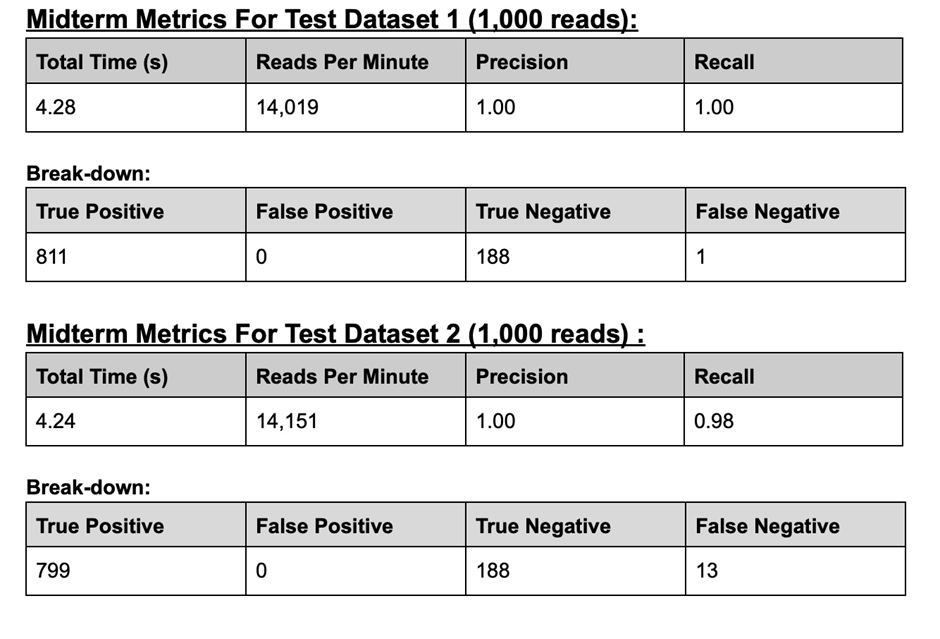

## Description

### What is Read Mapping
Read mapping aligns short DNA sequences (reads) to a reference genome. It is a fundamental task in computational biology, relevant to reference-guided assembly, structural variant calling, single nucleotide variant calling, and gene expression analysis. The reference genome contains millions to billions of nucleotides, while individual reads are typically between 75 and 300 nucleotides in length. The goal of short read mapping is to determine the start and end positions of each read within the reference genome. The challenge is that the mapping is an extremely time consuming and computation intensive effort, given the huge length of the reference genome. 

### Our Solution
We built a fast, efficient read mapper capable of handling large-scale sequencing data with high accuracy:
1. **Indexing**: The reference genome is indexed using k-mers for efficient querying.
2. **Seeding**: Multiple seeding increases the mapping success rate.
3. **Smith-Waterman**: Dynamic Programming optimizes the mapping process.
4. **Parallelization**: Processes reads in parallel to improve performance on large datasets.

### Key Features
- Efficient alignment using index-based k-mer matching.
- Handles reverse complements for accurate alignment.
- Optimized using Dynamic Programming for precise mapping.
- Parallel processing for large datasets.

This tool balances performance and precision, making it ideal for genome read mapping.

---

## Team members

Bowen Yao (by18) 

Jingwu Wang (jw133) 

Yuqi Chen (yc138) 

Zikang Chen (zc45) 


---

## Table of Contents
1. [Repository Structure](#repository-structure)
2. [Python Environment Set-up](#python-environment-set-up)
3. [Package Installation](#package-installation)
4. [Usage](#usage)
5. [Data](#data)
6. [Design](#design)
7. [Limitations](#limitations)
8. [Further Development](#further)
9. [References](#references)

---

## Repository Structure

```bash
BJYZ/
├── src/
│   ├── fasta_reader.py     # Reader class for reference genome
│   ├── fastq_reader.py     # Reader class for sequence reads
│   ├── sam_writer.py       # Writer class for SAM Files
│   ├── substring_index.py  # Indexing + SW algorithm
│   ├── read_mapper.py      # Project main entry point for NOTS
│   ├── read_mapper_local.py    # Project main entry point for local machine
├── tests/
│   ├── test_fasta_reader.py    # Unit tests for fasta_reader
│   ├── test_fastq_reader.py    # Unit tests for fastq_reader
│   ├── test_sam_writer.py      # Unit tests for sam_writer
│   ├── test_substring_index.py # Unit tests for substring_index algorithm
│   ├── test_index_parallel.py  # Unit tests for parallel version
│   └── file/               # Short example input files
│       ├── example.fasta   # example fasta file
│       └── example.fastq   # example fastq file
├── data/                   # Folder containing input file
│   ├── fasta files
│   └── fastq files
├── doc/
│   ├── BJYZ Design Document.pdf       # Design document
│   ├── BJYZ Final Presentation.pdf    # Final presentation slides
│   ├── BJYZ Midterm Presentation.pdf  # Midterm Presentation slides
│   ├── final_result.png               # Summary of final metrics
│   ├── midterm_result.png             # Summary of midterm metrics
│   ├── roles.png                      # Summary of role assignment
│   └── workflow.png                   # UML file
├── test.slurm              # slurm for testing 
├── test-result.out         # slurm output for testing that contains the number of reads
├── generate-sam.slurm      # slurm for generating sam for challenging dataset 1
├── generate-sam-result.out # slurm out for generating sam for challenging dataset 1
├── midterm-dataset-1.sam   # sam file for midterm dataset 1
├── requirements.txt        # Python dependencies
└── README.md               # Description of project
```

---

## Python Environment Set-up
Prerequisite: `Python 3.7+`, `pip/pip3`.

To isolate the environment and manage dependencies, create and activate a virtual environment:

```bash
python3 -m venv myenv
source myenv/bin/activate
```
or
```bash
python3 -m venv myenv
source myenv/bin/activate.csh
```

---

## Package Installation 

```bash
pip install -r requirements.txt
```

### OR To install packages one by one. 

To parse FASTA and FASTQ input files, install the Biopython package by running `pip install bio` in your terminal. Verify the installation with `pip show bio`. Additionally, Biopython requires NumPy. If NumPy is not installed, you can add it by running `pip install numpy`.

To measure the performance of the mapper, install the psutil package by running `pip install psutil` in your terminal.

---

## Usage

### To run on your local machine: 

#### To generate a sam file based on input fastq and fasta files: 

Step 1: Move the fasta and fastq files under the `data/` directory. 

Step 2: Run the program with below command. You can feel free to provide your own file.
```bash
python src/read_mapper_local.py --fasta short_reads_ref_genome.fasta --fastq short_reads_1_1000_subset.fastq -o output.sam
```
You can also see usage by specifying the `-h` flag.
```bash
python src/read_mapper_local.py -h
```

Step 3: The output sam file should appear at the root director as `output.sam`. 

#### To test metrics of the mapper: 

Step 1: Move the fasta and fastq files under the `data/` directory. 

Step 2: cd into tests folder. 

Step 3: Run 
```bash
python test_index_parallel.py
```
The metrics will be printed to the standard output.

### To run on NOTS: 

#### To generate a sam file based on input fastq and fasta files: 

Step 1: Move the fasta and fastq files under the `data/` directory. 

Step 2: Update the command line arguments in the generate-sam.slurm to specify the path of datasets you are using relative to the data/ folder.

Step 3: Submit the slurm to NOTs by 
```bash
sbatch generate-sam.slurm
```
Step 4: The output sam file should appear at the root directory as `output.sam`. 

#### To test metrics of the mapper: 
Step 1: Move the fasta and fastq files under the `data/` directory. 

Step 2: Submit the slurm to NOTs by 
```bash
sbatch test.slurm
```

Step 3: Check test-result.out in root for metrics. 

---

## Data

### For the midterm:

We have provided one reference fasta file and two fastq file for reference. 

If need more data, please download the corresponding fasta/fastq files and move them to `data/` directory.

These is the provided fasta file.
`short_reads_ref_genome.fasta` It is the reference genome. 

These are the two provided fastq files.
`short_reads_1_1000_subset.fastq` Contains 1000 reads of the reference genome in FASTQ format.
`short_reads_2_1000_subset.fastq` Contains another set of 1000 reads of the reference genome in FASTQ format.

These is the provided ground truth file to compare with.
`short_read_ground_truth_1_base.txt`
The table includes:
    First column: sequence IDs.
    Second column: start position mapping on the reference genome.
    Third column: end position mapping on the reference genome.

### For the final: 

The challenging read datasets and reference genome are too big to be pushed onto Github. It is expected that users will download them from Rice box by themselves and move them into the `data/` directory. 

There should be two fastq files. 
`challenging_dataset_1.fastq` A challenging dataset of reads of the reference genome in FASTQ format. 
`challenging_dataset_2.fastq` Another challenging dataset of reads of the reference genome in FASTQ format. 

There should be one fastq file. 
`short_reads_ref_genome.fasta` It is the reference genome. 

These also should be a ground truth file to compare with.
`challenging_ground_truth.txt`
The table includes:
    First column: sequence IDs.
    Second column: start position mapping on the reference genome.
    Third column: end position mapping on the reference genome.

There should a reference sam file. `challenging.sam`

---

## Design
### Program Input
A FASTA file (reference genome) and a FASTQ file (reads). 

### Preprocessing
Use the Biopython library to parse the FASTA and FASTQ files. 

### Indexer
For the reference genome, we determine the value of k—set to 20 in this case for optimal performance. We then iterate through all k-mers in the reference genome, storing their starting indices in a hash table.

### Alignment
For each read, we fine-tune the parameters by setting the seed length to k and selecting (length of read / 2) evenly spaced seeds per read. Each seed is mapped to the reference genome using the pre-built hash table. Next, we extract a corresponding region of 150 base pairs from the reference genome that contains the seed. The banded Smith-Waterman algorithm is then applied to this region and the read to compute an alignment score. If the score exceeds the early exit threshold (set to 0.1 * the read length), we terminate the loop and assign this start index as the alignment for the read. Otherwise, we move on to the next seed. If no match is found after examining all seeds, we repeat the process for the reverse complement of the read.

### Validation
We have developed comprehensive testing for our implementation. It computes the quality and speed of our algorithm. Specifically, it prints out the precision, recall, and run time. 

### Output
SAM file containing all the matches (start and end positions) for reads. 

### More detailed algorithm description

Final algorithm: 

1. Preprocessing the Reference Genome
Goal: Speed up lookups for aligning incoming reads by indexing all k-length substrings (k-mers) of the reference genome.
We chose k = 20. The exact size depends on desired specificity: larger k reduces false matches but might miss variants, while smaller k might yield too many candidates. Then, for the given reference genome G, extract every k-length substring and record its starting index. Store these mappings in a hash table, where keys are k-mer strings and values are lists of all start indices in G where that k-mer appears. 

2. Processing the Read and Seed Generation
Goal: Use seeds of the read to quickly locate potential alignment regions in the reference genome.

Given a short read R of length |R|, define a seed length k (the same k used for indexing the reference). The read is divided into a series of seeds, S_1, S_2, …, S_l. We choose l = |R| / 2 when using k=20. 

3. Retrieving Potential Candidate Locations
Goal: Identify where in the reference genome these seeds appear to narrow down potential alignment targets.
For each seed S_i, use the precomputed hash table from Step 1 to find all reference start indices H(S_i) = {I_{i1}, I_{i2}, …} where that seed occurs. Next, we extract a corresponding region of 150 base pairs from the reference genome that contains the seed. 

4. Applying the Banded Smith-Waterman Alignment
Goal: Efficiently compute the optimal local alignment between the read and each candidate reference substring.

A full Smith-Waterman alignment compares every cell of a 2D dynamic programming matrix, which can be computationally expensive. To optimize, we restricted the alignment computation to a diagonal band around the main diagonal of the DP matrix. This reduces computational complexity significantly. For each candidate region G_c, run the banded SW algorithm with the read R. The algorithm yields an alignment score A(I_{ij}), which measures how well R aligns to that portion of G.

5. Scoring and Early Exit Strategy
Goal: Quickly decide when a good enough alignment is found and avoid unnecessary computation.

Define a threshold score: τ=0.1×∣R∣ This means if the alignment score A(I_{ij}) for a candidate region exceeds 10% of the read length (or another chosen proportion), we consider this candidate sufficiently good to stop searching further. This threshold helps save time: as soon as a reasonably good alignment is discovered, the mapper exits early and reports this alignment.

If the current candidate region does not surpass τ, move on to the next candidate reference start index. Keep checking until either: A suitable candidate is found (score > τ), or all candidates have been exhausted without finding a good alignment.

6. Reverse Complement Case
Goal: Handle reads that map to the opposite strand of the reference.

If no candidate region yields a score above τ, compute the reverse complement of the read R and repeat steps starting from the seeding process (Step 2) with the reversed read. If this still yields no good alignments, the read may be considered unmapped.

7. Constructing the Final Alignment Output
Goal: Once a good alignment is found, finalize the reporting.

After identifying the best scoring alignment (either in forward or reverse-complement orientation), trace back through the Smith-Waterman DP matrix to reconstruct the alignment operations. These operations are often summarized in a CIGAR string. If multiple candidate regions produce good scores, the one with the highest score is chosen. 
 
Besides the three parameters we had in the midterm, we now have a new parameter for our final implementation: the bandwidth of the banded SWT algorithm. We observe that when we have a smaller number for bandwidth, the number of reads will increase significantly, but the accuracy will be compromised as well. Finally, we chose a bandwidth of 8. 

### High-Level Design


### Midterm Result


### Final Result


## Limitations
The parameters in the algorithm are fine-tuned towards the challenging datasets that were provided. If another dataset is used for testing, those parameters might not be the best ones in terms of accuracy and performance. 

## Further Development
Inspired by other groups, we will try to use Cython to compile the python code into C code to reduce the run time. 
We will also look into how to utilize the GPUs on NOTS for further acceleration. 

## References
Algorithm Ideas
https://www.langmead-lab.org/teaching.html

I/O Helper
https://biopython.org/wiki/SeqIO

Alser, M., Rotman, J., Deshpande, D., Taraszka, K., Shi, H., Baykal, P. I., Yang, H. T., Xue, V., Knyazev, S., Singer, B. D., Balliu, B., Koslicki, D., Skums, P., Zelikovsky, A., Alkan, C., Mutlu, O., & Mangul, S. (2021). Technology dictates algorithms: Recent developments in read alignment. Genome Biology, 22(1). https://doi.org/10.1186/s13059-021-02443-7 

Y. -L. Liao, Y. -C. Li, N. -C. Chen and Y. -C. Lu, "Adaptively Banded Smith-Waterman Algorithm for Long Reads and Its Hardware Accelerator," 2018 IEEE 29th International Conference on Application-specific Systems, Architectures and Processors (ASAP), Milan, Italy, 2018, pp. 1-9, doi: 10.1109/ASAP.2018.8445105. 

Treangen, T. J., & Salzberg, S. L. (2011). Repetitive DNA and next-generation sequencing: computational challenges and solutions. Nature reviews. Genetics, 13(1), 36–46. https://doi.org/10.1038/nrg3117
